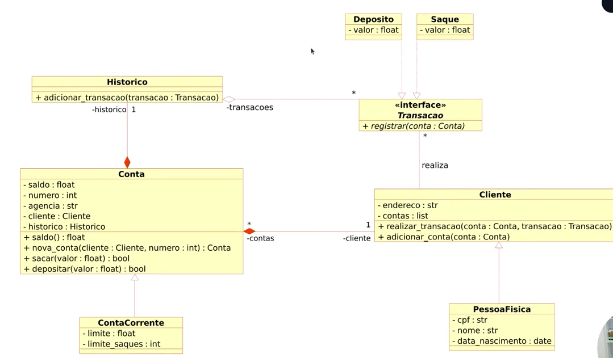

# Projeto

O Projeto proposto foi de modelar o [código fonte](https://github.com/digitalinnovationone/trilha-python-dio/blob/main/01%20-%20Estrutura%20de%20dados/desafio.py).

## Objetivo Geral

Iniciar a modelagem do sistema bancário em POO.  
Adicionar classes para cliente e as operações bancárias: depósito e saque.

## Desafio

Atualizar a implementação do sistema bancário, para armazenar os dados de clientes e contas bancárias em objetos ao invés de dicionários.  
O código deve seguir o modelo de classes UML a seguir:

### Observações

Classe Conta  

* as 5 propriedades são privadas (sinal -)
* `nova_conta(cliente:Cliente, numero:int):Conta` é um método de fábrica, cria uma conta.
* `sacar(valor:float)` e `depositar(valor:float)` retornam `bool` para representar se a operação deu certo ou falhou
* tem uma classe filha `ContaCorrente`
* atributo `historico` é tipo classe `Historico`: a `Conta` tem um `Historico`, e o `Historico` pertence a uma `Conta`.

Classe ContaCorrente

* tem tudo o que a classe `Conta` tem mais o `limite` e `limite_saques`

Classe Historico

* tem um método `adicionar_transacao(transacao: Transacao)`, o argumento é do tipo `Transacao`

Classe Transacao

* é uma interface, uma classe abstrata
* tem um método `registrar(conta: Conta)`
* tem 2 classes (`Deposito` e `Saque`)que implementam essa classe `Transacao`

Classe Cliente

* atributo `contas` é uma lista de contas, pois o cliente pode ter mais de uma conta
* `realizar_transacao(conta: Conta, transacao: Transacao)`, a transacao pode ser um `Deposito`ou `Saque`, mas precisa olhar a `Transacao` (a classe abstrata para termos um polimorfismo)

Classe PessoaFisica

* é um tipo de `Cliente`

## Desafio extra

Após concluir a modelagem das classes e a criação dos métodos.  
Atualizar os métodos que tratam as opções do menu, para funcionarem com as classes modeladas.
