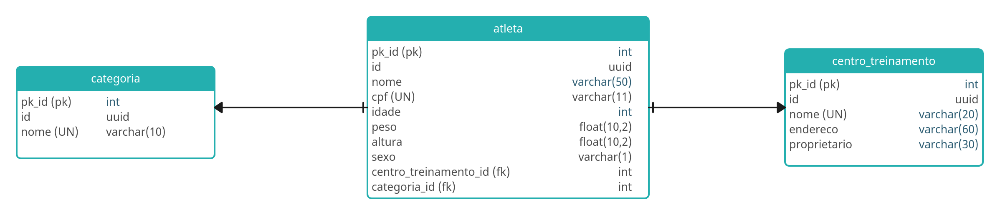

# P3  - Desenvolvendo sua Primeira API com FastAPI, Python e Docker

Desafio proposto pela DIO na trilah de Back-End, na proposta de elaborar um sistema de banco de dados integrado à API.  

Referência: <https://github.com/digitalinnovationone/workout_api>

O contexto basea-se em uma academia na qual possui **Atletas** e seus respectivos **Centro de Treinamento** e **Categorias**, conforme apresentado no esquema abaixo:

São 3 Tabelas conforme abaixo:



Cada **Atleta** possui um único **Centro de Treinamento** e **Categoria**, em uma relação `1 - n`.  
E cada **Centro de Treinamento** e **Categoria** pode possuir diversos Atletas diferentes `n - 1`

P.S: Embora no título esteja uma menção à Docker, nada do tema foi passados às aulas, então o projeto estará sendo desenvolvido fora de container.

## Sobre as requisições da API

Através do uso da FastAPI é proposto consultar e editar o banco de dados a partir das seguintes endpoints de cada entidade:

### Atleta

* POST `/atletas/` Criar um novo Atleta
* GET `/atletas/` Consultar atletas
* GET `/atletas/{id}` Consultar um Atleta pelo ID
* PATCH `/atletas/{id}` Editar um Atleta pelo ID
* DELETE `/atletas/{id}` Deletar um Atleta pelo ID

### Categorias

* GET `/categorias/` Consultar categorias
* POST `/categorias/` Criar uma nova Categoria
* GET `/categorias/{id}` Consultar uma categoria por id

### Centro_treinamento

* GET `/centros_treinamento/` Consultar Centros de Treinamento
* POST `/centros_treinamento/` Criar um novo Centro de Treinamento
* GET `/centros_treinamento/{id}` Consultar um Centro de Treinamento por id

## Estrutura de Dados

### Dados do Atleta

```json
{
    "id":"2r890ewfuh298wrywq",
    "created_at": "2023-07-27T18:30:53.637789",
    "nome":"Joao",
    "centro_treinamento": {
        "nome":"CT King"
    },
    "categoria":{
        "nome":"Scale"
    },
    "idade":25,
    "peso":81.5,
    "altura":1.75,
    "cpf":"12345678999",
    "sexo":"m"
}
```

## Desafio Final

```txt
- adicionar query parameters nos endpoints
    - atleta
        - nome
        - cpf
- customizar response de retorno de endpoints
    - get all
        - atleta
            - nome
            - centro_treinamento
            - categoria
- Manipular exceção de integridade dos dados em cada módulo/tabela
    - sqlalchemy.exc.IntegrityError e devolver a seguinte mensagem: “Já existe um atleta cadastrado com o cpf: x”
    - status_code: 303
- Adicionar paginação utilizando a lib: fastapi-pagination
    - limit e offset
```
